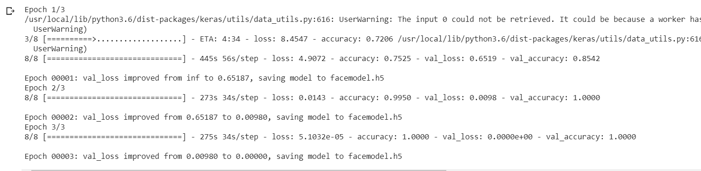

# Face Recognisation using Transfer Learning with VGG16 model


## Transfer Learning


Transfer learning (TL) is a research problem in machine learning that focuses on storing knowledge gained while solving one problem and applying it to a different but related problem. For example, knowledge gained while learning to recognize cars could apply when trying to recognize trucks. This area of research bears some relation to the long history of psychological literature on transfer of learning, although formal ties between the two fields are limited. From the practical standpoint, reusing or transferring information from previously learned tasks for the learning of new tasks has the potential to significantly improve the sample efficiency of a reinforcement learning agent.


### ARCHITECTURE OF VGG16 MODEL     
   
   
   
   
   
   
  ##### DATA COLLECTION USING DATACOLLECTOR.PY CODE
   
```python

import os 
import cv2

def photo(maxcount):
  #maxcount means how many photos you want to click

    folder=r"foldername" 

    #for example : folder for testing:
    # "D:/data/train/foldername/"
    # "D:/data/test/foldername/"
    
    
    cap=cv2.VideoCapture(0)
    count=0
    while True:
        status,image=cap.read()
        if status:
            count=count+1
            image=image[100:500,200:700]
            file="file{0}".format(count) + ".jpg"
            file=os.path.join(folder,file)
            cv2.imwrite(file,image)
            cv2.putText(image,str(count),(150,150),cv2.FONT_HERSHEY_SIMPLEX,1,(255,234,0),2)
            cv2.imshow("photo",image)

        
        
            if cv2.waitKey(100) == ord('q') or count == int(max_count): 
                break
    cv2.destroyAllWindows()
    print('Total photo clicked {0}'.format(count))
    cap.release()
```


#### FACE RECOGNIZATION


```python

from keras.applications import vgg16

model=vgg16.VGG16(weights="imagenet",include_top=False,input_shape=(224,224,3))

for layer in model.layers:
  layer.trainable=False

model.summary()

from keras.layers import Dense,Flatten,Dropout
def addTopModel(bottom_model, num_classes, D=256):
    """creates the top or head of the model that will be 
    placed ontop of the bottom layers"""
    top_model = bottom_model.output
    top_model = Flatten(name = "flatten")(top_model)
    top_model = Dense(D, activation = "relu")(top_model)
    top_model = Dropout(0.3)(top_model)
    top_model = Dense(num_classes, activation = "softmax")(top_model)
    return top_model
    
model.input
model.layers

from keras.models import Sequential
from keras.layers import Dense, Dropout, Activation, Flatten
from keras.layers import Conv2D, MaxPooling2D, ZeroPadding2D
from keras.layers.normalization import BatchNormalization
from keras.models import Model

num_classes = 2

FC_Head = addTopModel(model, num_classes)

modelnew = Model(inputs=model.input, outputs=FC_Head)

print(modelnew.summary())

from keras.preprocessing.image import ImageDataGenerator

train_data_dir=r"drive/My Drive/data/train"
validation_data_dir=r"drive/My Drive/data/test"

train_datagen=ImageDataGenerator(
      rescale=1./255,
      rotation_range=20,
      width_shift_range=0.2,
      height_shift_range=0.2,
      horizontal_flip=True,
      fill_mode='nearest')
 
validation_datagen = ImageDataGenerator(rescale=1./255)
img_rows=224
img_cols=224

train_batchsize = 64
val_batchsize = 64
 
train_generator = train_datagen.flow_from_directory(
        train_data_dir,
        target_size=(img_rows, img_cols),
        batch_size=train_batchsize,
        class_mode='categorical')
 
validation_generator = validation_datagen.flow_from_directory(
        validation_data_dir,
        target_size=(img_rows, img_cols),
        batch_size=val_batchsize,
        class_mode='categorical',
        shuffle=False)

from keras.optimizers import RMSprop
from keras.callbacks import ModelCheckpoint, EarlyStopping
                   
checkpoint = ModelCheckpoint("facemodel.h5",
                             monitor="val_loss",
                             mode="min",
                             save_best_only = True,
                             verbose=1)

earlystop = EarlyStopping(monitor = 'val_loss', 
                          min_delta = 0, 
                          patience = 3,
                          verbose = 1,
                          restore_best_weights = True)

# we put our call backs into a callback list
callbacks = [earlystop, checkpoint]

# Note we use a very small learning rate 
modelnew.compile(loss = 'categorical_crossentropy',
              optimizer = RMSprop(lr = 0.001),
              metrics = ['accuracy'])

nb_train_samples = 544
nb_validation_samples = 200
epochs = 3
batch_size = 64

history = modelnew.fit_generator(
    train_generator,
    steps_per_epoch = nb_train_samples // batch_size,
    epochs = epochs,
    callbacks = callbacks,
    validation_data = validation_generator,
    validation_steps = nb_validation_samples // batch_size)


modelnew.save("model.h5")

```


#### TESTING:

```python

from keras.applications.vgg16 import preprocess_input
from keras.preprocessing import image
from keras.models import load_model
modelnew=load_model("model.h5")

oimg=image.load_img(r"testingfoldername",target_size=(224,224))
oimg.size

img=image.img_to_array(oimg)
import numpy as np
img.shape

img=np.expand_dims(img,axis=0)
img.shape
img=modelnew.predict(img)

# from keras.applications.vgg16 import decode_predictions
# decode_predictions(img)

img.shape
img

if img[0][0]==1 and img[0][1]==0:
  char="OBJECT1"
elif img[0][0]==0 and img[0][1]==1:
  char="OBJECT2"
else:
  char="DONT KNOW"
# from keras.applications.vgg16 import decode_predictions
# decode_predictions(img)

print(char)

image.array_to_img(oimg)

modelnew.save("model.h5")

model.summary()

```


    
    
    
  

  
   
